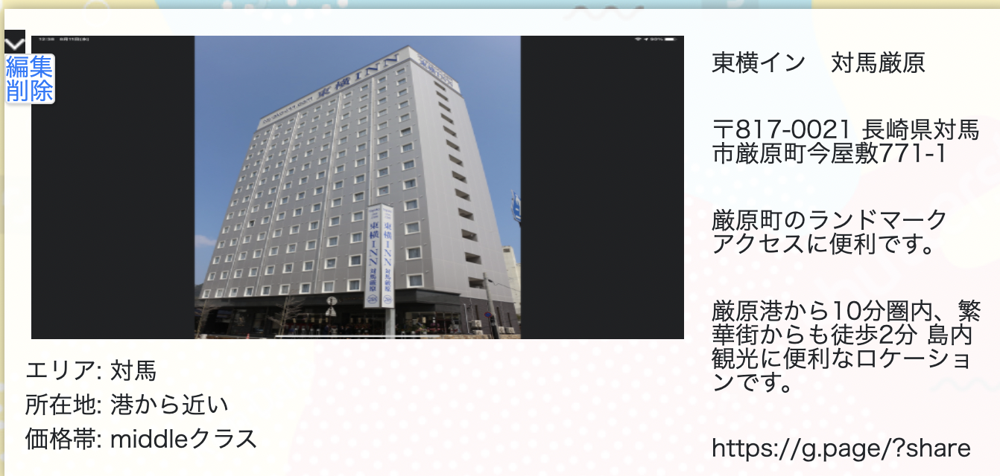
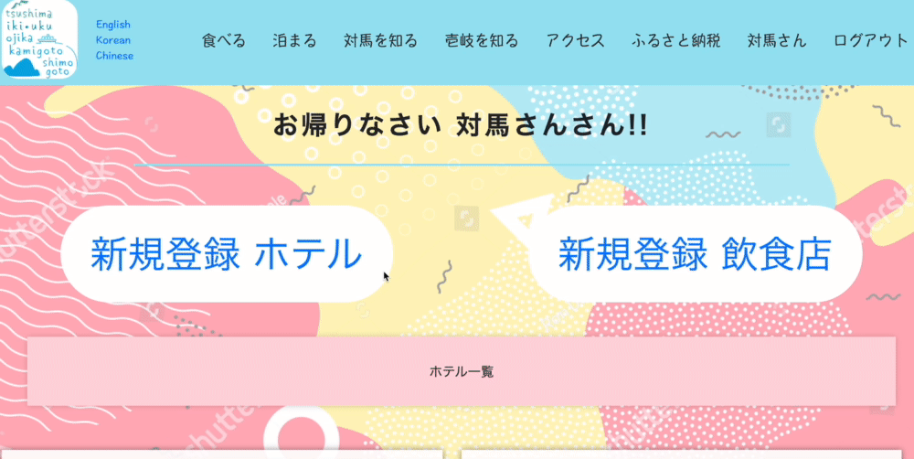
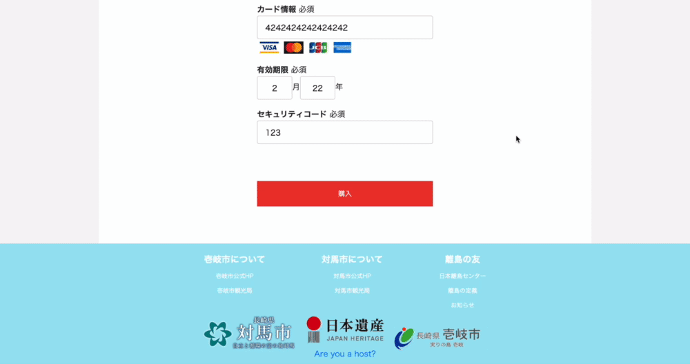
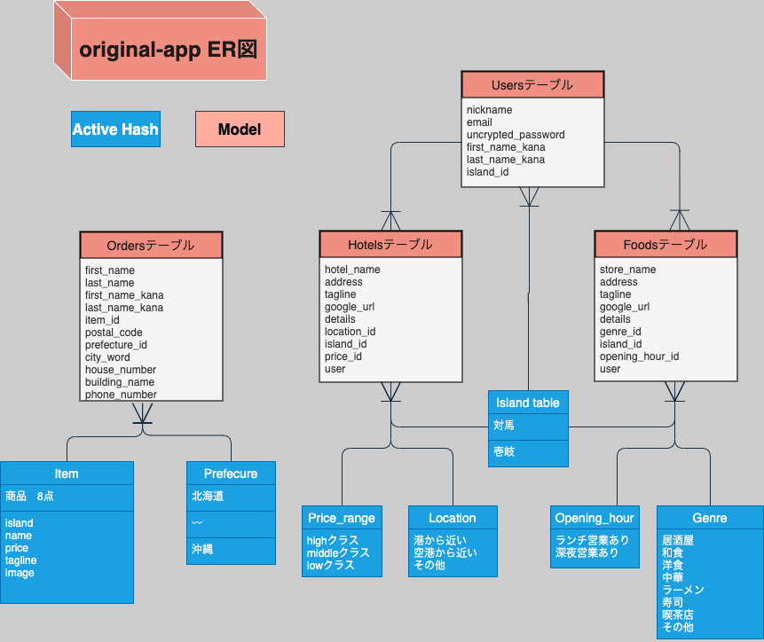

### README

# アプリ名
## 「日本遺産壱岐対馬 情報発信サイト　島ちょうだい！」

# 概要
閲覧者（旅行先を選定したい人） 
『コロナ蔓延鈍化以降のマイクロツーリズム流行に向けた壱岐対馬情報発信サイト』   
管理者（壱岐対馬の観光局で勤めている人） 
 『手軽に情報の更新管理』

# URL :page_with_curl:
http://35.74.120.34/

# テスト用アカウント :credit_card:
Basic認証   ユーザー名:admin       Password:2222 
管理者      email:koko@gmail.com  Password:111111w 
クレジットカード番号 4242424242424242 
有効期限 現在より未来の日付 
セキュリティコード 123  

# ペルソナ
### <管理者　:older_woman: :older_man:>
・(住まい)          島の観光局職員 
・(年齢)            40代〜50代 
・(持っている課題)
距離的な問題か、観光客が少ないかつ、コロナ蔓延でより客足がより少ない 
現地の観光局等職員が高齢で気軽に情報を投稿更新できない（Wordpress初見だと難しい）

### <閲覧者:woman: :man:>
・(住まい)                  九州在住 
・(年齢)                    30〜50代 
・(持っている課題)
コロナが落ち着いてからの旅行先選定、人気の多いところには行きたくない 
・(離島に対してのイメージ)
離島への旅行って遠そう 何があるのか分からない
              

# 目指すもの :checkered_flag:
以上の２者の課題解決のため、

・情報管理のしやすさ 
・マイクロツーリズムに則った新しい離島観光需要の創出 

といった観光情報発信Webサイトの作成を目指す。

# 工夫した点 :black_nib:
市公式の観光サイトではない、「離島旅行」という形で推すWebサイトという位置付けにした点。 
閲覧者が出来るだけサイト内に留まってもらえるように、動画や写真の挿入、クリックした時の要素にCSSjQueryで遊びを入れた点。 
離島がどのような場所か想像が出来るよう、島までのアクセスなどの、体験できる内容を写真動画を用いて訴求した点。 

# ページ遷移図　

# 実装画像動画 :movie_camera:
## トップページ

#### Point
ヘッダー部左：アイコンには、ホバーで浮き上がる仕様 
ヘッダー部右：リンクリストは、ホバーで白下線が出てくる使用 
画面中央：jQueryプラグインのslickを使用し、画像のスライド形式で設置 

## ログインページ　サインインページ

#### Point
トップページ画面最下部：「管理者はこちら」をクリック後ログインページに飛ぶ 
ホストでなければ「管理者登録はこちら」をクリック後ユーザー登録 

## 管理者トップページ

#### Point
トップ画面ヘッダー部右：ログインユーザー専用の項目が増える。自分のニックネームをクリックで管理者トップページへ 
・自身が投稿しているデータ一覧を確認 
・ホテル飲食店の新規登録のページへ 
・既存ホテル飲食店データの編集削除 

＜管理者トップページに全ての機能を集約し、文字を大きく、シンプルな設計＞ 

編集削除ボタン↓

## ホテル飲食店の新規登録

#### Point
入力のシンプルに
入力情報は以下の「食べる」「泊まる」ページにて閲覧者が見る事が出来る 

エラーが起きた場合の日本語設定↓↓

## 食べる　泊まる

#### Point
画面中段：検索機能 ヒット数のカウント表示 
画面下段：飲食店データの表示 
管理者によって入力されたデータがこちらに出力される 

該当する条件にヒットしなかった場合、「検索ヒットしませんでした」の表示↓↓

## 対馬を知る　壱岐を知る

#### Point
画面中段：項目をクリックすると、下段の該当する画像のみ表示される 
jQueryプラグイン Muuri 

画像クリック時：画像大画面表示（全て個人で撮った写真、情景の説明書きあり）↓↓ 
jQueryプラグイン fancybox 

## アクセス

#### Point
様々なアクセス方法がある中、船での移動にフォーカス。 
画面中段：いくつかある港でも旅行に最適な港を絞ってGoogle Mapで移動時間を紹介 
画面下段：個人的に撮った動画 乗船時の雰囲気を紹介 

## ふるさと納税
商品一覧

購入ページ

#### Point
商品データはActiveHashを利用して管理 
クレジット機能を用いて購入可能。 
お金の落ちるチャンネルを観光だけでなく、ふるさと納税という観点も増やしたいと考え実装追加 

# 使用技術 :art:
Ruby/RubyonRails/JavaScript/jQuery/MySQL/SequelPro/ 
AWS(EC2,S3)/Capistrano/Nginx/Unicorn/Github/Github Desktop/ 
slick/fancybox/Muuri/ 
devise/active_hash/mini_magick/image_processing/ransack/pry-rails/payjp/rails-i18n 
rubocop/rspec-rails/factory_bot_rails/faker/gimei/ 

# 課題や今後実装したい機能 :eyes:
＜閲覧者面＞ 
スマホで見れるようにレスポンシブ対応 
ヘッダー各要素のハンバーガーメニュー表示 
購入内容確認画面の設定 
アクセスページの要素にanimation(fadeupなど)付けて面白くする 

＜管理者面＞ 
ホテル飲食店の画像投稿前にプレビューをつける 

# テーブル設計

## Users テーブル

|Column            |Type   |Options                  |
|------------------|-------|-------------------------|
|nickname          |string |null: false              |
|email             |string |null: false              |
|encrypted_password|string |null: false              |
|first_name_kana   |string |null: false              |
|last_name_kana    |string |null: false              |
|island_id         |integer|null: false              |

### Association
has_many foods 
has_many hotels 
belongs_to island (activeHash) 
  

## Foods テーブル

|Column                 |Type       |Options                        |
|-----------------------|-----------|-------------------------------|
|store_name             |string     |null: false                    |
|address                |string     |null: false                    |
|tagline                |string     |null: false                    |
|google_url             |string     |null: false                    |
|details                |string     |null: false                    |
|genre_id               |integer    |null: false                    |
|island_id              |integer    |null: false                    |
|opening_hour_id        |integer    |null: false                    |
|user                   |references |null: false, foreign_key: true |

### Association
belongs_to user 
belongs_to genre        (activeHash) 
belongs_to island       (activeHash) 
belongs_to opening_hour (activeHash)   

## Hotels テーブル

|Column                 |Type       |Options                        |
|-----------------------|-----------|-------------------------------|
|hotel_name             |string     |null: false                    |
|address                |string     |null: false                    |
|tagline                |string     |null: false                    |
|google_url             |string     |null: false                    |
|details                |string     |null: false                    |
|location_id            |integer    |null: false                    |
|island_id              |integer    |null: false                    |
|price_range_id         |integer    |null: false                    |
|user                   |references |null: false, foreign_key: true |

### Association
belongs_to user 
belongs_to island      (activeHash) 
belongs_to location    (activeHash) 
belongs_to price_range (activeHash) 

## Orders テーブル

|Column           |Type       |Options                        | 
|-----------------|-----------|-------------------------------|
|first_name       |string     |null: false                    |
|last_name        |string     |null: false                    |
|first_name_kana  |string     |null: false                    |
|last_name_kana   |string     |null: false                    |
|item_id          |integer    |null: false                    |
|postal_code      |string     |null: false                    |
|prefecture_id    |integer    |null: false                    |
|city_word        |string     |null: false                    |
|house_number     |string     |null: false                    |
|building_name    |string     |                               |
|phone_number     |string     |null: false                    |

### Association
belongs_to item       (activeHash) 
belongs_to prefecture (activeHash) 
